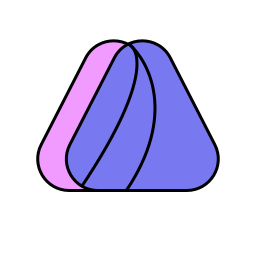

<div align=center>




# Deltaline


**[Website](https://deltaline.netlify.app/) | [Docs](https://deltaline-docs.netlify.app)** 

 [](https://github.com/No767/Deltaline/actions/workflows/codeql-analysis.yml) [](https://github.com/No767/Deltaline/actions/workflows/snyk.yml) [](https://app.netlify.com/sites/deltaline/deploys) [](https://www.codacy.com/gh/No767/Deltaline/dashboard?utm_source=github.com&amp;utm_medium=referral&amp;utm_content=No767/Deltaline&amp;utm_campaign=Badge_Grade) 

A Open-Source Digital Portfolio for Classwork

<div align=left>

## Getting Started (For Developers)
Under the hood, Deltaline uses [Next.js](https://nextjs.org). TypeScript support is already included out of the box.

### Requirements

- Node
- Git

### Windows

1. Install Node, and Git. Make sure to also check if you have npm installed. You may find it helpful to use nvm for windows instead

2. Fork this repo, and then clone the forked repo

3. Install all dependencies


    ```sh
    cd Deltaline/nextjs-deltaline && npm install
    ```

4. (Optional) Run the dev server to get started:

    ```sh
    npm run dev
    ```

### MacOS

1. Install Node, and Git. Make sure to also check if you have npm installed. You may find it helpful to use nvm instead

2. Fork this repo, and then clone the forked repo

3. Install all dependencies


    ```sh
    cd Deltaline/nextjs-deltaline && npm install
    ```

4. (Optional) Run the dev server to get started:

    ```sh
    npm run dev
    ```

### Linux

1. Install Node and Git. Make sure to also have npm installed. It may be helpful to use nvm to manage your node versions

2. Fork this repo, and then clone the forked repo

3. Install all dependencies


    ```sh
    cd Deltaline/nextjs-deltaline && npm install
    ```

4. (Optional) Run the dev server to get started:

    ```sh
    npm run dev
    ```


# License
This repo is licensed under the [GPL-3.0](https://github.com/No767/Deltaline/blob/dev/LICENSE.txt) License. Further licensing info can be found [here](https://deltaline-docs.netlify.app/docs/terms-and-conditions/licensing)
